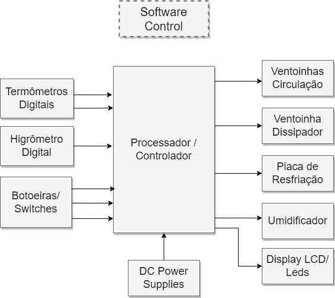

# ` Climatizador Automático `
# ` Auto Acclimatizer `

## Apresentação

O presente projeto foi originado no contexto das atividades da disciplina de graduação *EA075 - Introdução ao Projeto de Sistemas Embarcados*, 
oferecida no segundo semestre de 2023, na Unicamp, sob supervisão da Profa. Dra. Paula Dornhofer Paro Costa, do Departamento de Engenharia de Computação e Automação (DCA) da Faculdade de Engenharia Elétrica e de Computação (FEEC).

|Nome  | RA | Curso|
|--|--|--|
| Aron Simoes Ferreira Maciel  | 261064 | Eng. da Computação|
| Erivelton da Rocha Tavares   | 170645 | Eng. Elétrica|

## Descrição do Projeto
O Climatizador Automático foi idealizado pensando no conforto das pessoas que aderiram às novas modalidades de trabalho (home office) e estudo (aulas EAD) para que elas possam ter um ambiente agradável tanto em termos de temperatura quanto de umidade.  
O nosso Climatizador se propõe a ser uma solução portátil, ou seja, de encapsulamento razoavelmente pequeno e também ser uma solução mais ecônonica em relação às soluções disponíveis hoje no mercado.

## Descrição Funcional
O Climatizador Automático permitirá ao usuário selecionar se deseja regular manualmente a temperatura e umidade ou realizar um controle automátizado - informando ao sistema o ciclo de temperatura ou umidade desejado. Para tanto haverá um display informando ao usuário a temperatura e umidade atual e botões que lhe permitirão entrar no modo configuração para selecionar o set point desejado (através de incremento/decremento de um valor default) ou criar seu ciclo automático.  
Uma vez definido o modo de operação, um watercooler será acionado para fazer a troca térmica e assim permitir resfriar ou aquecer o ambiente e ventoinhas farão a dissipação do ar. Além disso, um vaporizador/umidificador será acionado periodicamente para manter o ambiente na umidade desejada.

### Funcionalidades
O Climatizador Automático será capaz de controlar o ambiente da maneira que o usuário desejar através de:  
    - Controle de Temperatura Manual  
    - Controle de Temperatura Automático  
    - Controle de Umidade Manual  
    - Controle de Umidade Automático

### Configurabilidade
Será possível escolher entre operação manual e automática.  
  
Modo Manual: O usuário informará ao sistema o set point de temperatura e umidade desejado e o climatizador irá controlar o resfriamento e umidificação para atingir o requisito e permanecerá nessa rotina até que o usuário decida alterar o set point ou desligar o sistema.  
  
Modo Automático: O usuário entrará com pontos de temperatura e umidade que deseja e quanto tempo deve permanecer em cada um e também poderá definir em que momento o sistema deve ser desligado.

### Eventos
O sistema deve tratar os eventos de configuração feitos pelo usuário através do display LCD e dos botões e também os eventos de mudança de condições ambientais atuando assim no sistema de climatização e umidificação. Podemos classificar os eventos em periódicos e não periódicos, sendo eles:  
  
Não-Periódicos:  
    - Ação do usuário (ligar ou desligar e mudar a configuração);  
  
Periódicos:  
    - A cada 1 min realizar a leitura dos sensores de temperatura e umidade e comparar com o set point estabelecido;  
    - Acionar o sistema umidificador para manter a umidade no valor desejado. 
    Obs: A periodicidade deste evento depende da umidade ambiente e da umidade desejada;  
    - Acionar o watercooler e ventoinhas para resfriamento do ambiente.
    Obs: A periodicidade deste evento depende da temperatura ambiente e da temperatura desejada;

### Tratamento de Eventos
O tratamento do controle de temperatura se dará através do controle de velocidade das ventoinhas - o qual será feito através de PWM - a fim de aumentar ou diminuir o fluxo de vento, mantendo assim a temperatura desejada. Além disso, o sistema de watercooler utilizará a água para realizar a troca térmica com o ambiente.  
O tratamento da umidade será feita através do sistema umidificador que terá sua frequência de acionamento condizente com a diferença entre a umidade ambiente e a umidade desejada, ou seja, quanto maior a diferença entre estes parâmetros maior será a frequência de acionamento do sistema.  
Além disso, a cada minuto o display LCD será atualizado com as leituras dos sensores para que o usuário possa saber como está o ambiente.  
Por fim, a ação do usuário que se dará por meio dos botões será tratada via interrupções do processador.

## Descrição Estrutural do Sistema
O sistema será composto pelas seguintes dispositivos: 
- De entrada: 2 Termômetros digitais, um para medir a temperatura de saída do ar, outra pra medir a temperatura na placa térmica, um higrômetro para medir a umidade do ar, botoeiras e/ou switches para configuração do módulo.
- De saída: 2 Ventoinhas de circulação do ar, uma ventoinha de dissipação da placa termica, a placa termica em si, um dispositivo umidificador e displays LCD e/ou Leds para informar as informações de Temperatura e Umidade para o usuário.
- De controle: Um micro-controlador para realizar o controle de todos os dispositivos acoplados.

Abaixo podemos ver um Diagrama em blocos com a descrição estrutural do sistema:

## Referências
Seção obrigatória. Inclua aqui referências utilizadas no projeto.
